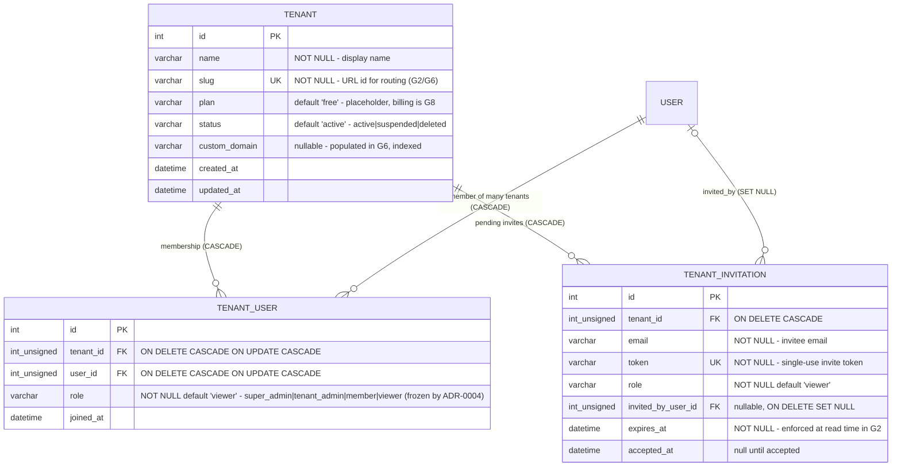

# ERD — Realized (As-Implemented Schema at G1 Close)

> Snapshot of the **realized** multi-tenant schema after Phase G1. This file mirrors [erd-to-be.md](./erd-to-be.md) (G0's deliverable and the **source-of-truth design**) and records what was actually implemented, mapped to the migration artifacts that produced each entity.
>
> Contract context: [migration-contract.md](./migration-contract.md) · Isolation model: [ADR-0002](../adr/ADR-0002-isolation-model.md).
>
> **Status:** verified by `test/backend-test/test-tenant-migration.js` (fresh-schema assertions + up → down → up idempotency with zero data loss). Pinned at G1 close; later phases (G2+) extend this schema via new migrations and must refresh this snapshot.

## Entity → producing artifact map

| Entity | Produced / altered by |
| --- | --- |
| `tenant`, `tenant_user`, `tenant_invitation` | `db/knex_migrations/2026-08-23-0000-create-tenant-tables.js` |
| `tenant_id` columns + composite indexes on the ten business tables | `db/knex_migrations/2026-08-23-0001-add-tenant-id-columns.js` |
| Default tenant seed (`slug = default`), backfill of pre-existing rows, `tenant_admin` memberships | `db/knex_migrations/2026-08-23-0002-seed-default-tenant.js` (idempotent helper exported for fresh-install reuse) |
| Base tables (`user`, `monitor`, `group`, `proxy`, `docker_host`, `notification`, `status_page`, `maintenance`, `api_key`, `tag`, `remote_browser`, `heartbeat`, `stat_*`, junction tables, `incident`, `setting`, ...) | `db/knex_init_db.js` `createTables()` (first-run bootstrap) plus pre-G1 migrations in `db/knex_migrations/` |

## New tenant-root entities (as-implemented)

Produced by `2026-08-23-0000-create-tenant-tables.js`; membership rows seeded by `2026-08-23-0002-seed-default-tenant.js`. Composite uniqueness: `UNIQUE(tenant_id, user_id)` on `tenant_user`; `UNIQUE(token)` on `tenant_invitation`; non-unique index `(tenant_id, email)`.

## Existing business entities — `tenant_id` added (as-implemented)

```mermaid
erDiagram
    TENANT {
        int id PK
    }

    MONITOR {
        int id PK
        int_unsigned tenant_id FK "+ NEW, nullable (see divergences), idx(tenant_id,id), idx(tenant_id,user_id)"
        int_unsigned user_id FK "retained as per-user owner link"
        varchar push_token "public ingestion key, now tenant-scoped via monitor"
    }

    GROUP {
        int id PK
        int_unsigned tenant_id FK "+ NEW, nullable, idx(tenant_id,id)"
        int_unsigned status_page_id "logical ref retained"
    }

    PROXY {
        int id PK
        int_unsigned tenant_id FK "+ NEW, nullable, idx(tenant_id,id)"
        int_unsigned user_id "retained"
    }

    DOCKER_HOST {
        int id PK
        int_unsigned tenant_id FK "+ NEW, nullable, idx(tenant_id,id)"
        int_unsigned user_id "retained"
    }

    NOTIFICATION {
        int id PK
        int_unsigned tenant_id FK "+ NEW, nullable, idx(tenant_id,id)"
        int_unsigned user_id "retained as per-user owner link"
    }

    STATUS_PAGE {
        int id PK
        int_unsigned tenant_id FK "+ NEW, nullable, idx(tenant_id,id)"
        varchar slug "uniqueness becomes (tenant_id, slug) in practice - resolution always pairs (tenant_id, slug)"
    }

    MAINTENANCE {
        int id PK
        int_unsigned tenant_id FK "+ NEW, nullable, idx(tenant_id,id)"
        int_unsigned user_id FK "retained"
    }

    API_KEY {
        int id PK
        int_unsigned tenant_id FK "+ NEW, nullable, idx(tenant_id,id)"
        int_unsigned user_id "retained"
    }

    TAG {
        int id PK
        int_unsigned tenant_id FK "+ NEW, nullable, idx(tenant_id,id)"
        varchar name "tags become per-tenant rows"
    }

    REMOTE_BROWSER {
        int id PK
        int_unsigned tenant_id FK "+ NEW, nullable, idx(tenant_id,id)"
        int_unsigned user_id "retained"
    }

    TENANT ||--o{ MONITOR : "owns (backfilled into default tenant)"
    TENANT ||--o{ GROUP : "owns (backfilled into default tenant)"
    TENANT ||--o{ PROXY : "owns (backfilled into default tenant)"
    TENANT ||--o{ DOCKER_HOST : "owns (backfilled into default tenant)"
    TENANT ||--o{ NOTIFICATION : "owns (backfilled into default tenant)"
    TENANT ||--o{ STATUS_PAGE : "owns (backfilled into default tenant)"
    TENANT ||--o{ MAINTENANCE : "owns (backfilled into default tenant)"
    TENANT ||--o{ API_KEY : "owns (backfilled into default tenant)"
    TENANT ||--o{ TAG : "owns (backfilled into default tenant)"
    TENANT ||--o{ REMOTE_BROWSER : "owns (backfilled into default tenant)"
```

All ten `tenant_id` columns are produced by `2026-08-23-0001-add-tenant-id-columns.js`; backfill into the default tenant by `2026-08-23-0002-seed-default-tenant.js`.

## Entities deliberately unchanged (as-implemented)

Matches the TO-BE decision — no `tenant_id` on these; tenancy is derived through a parent anchor (e.g. `... WHERE monitor_id IN (SELECT id FROM monitor WHERE tenant_id = ?)`):

```mermaid
erDiagram
    HEARTBEAT {
        int id PK
        int_unsigned monitor_id FK "unchanged - tenancy derived via monitor"
    }
    STAT_MINUTELY {
        int id PK
        int_unsigned monitor_id FK "unchanged"
    }
    STAT_HOURLY {
        int id PK
        int_unsigned monitor_id FK "unchanged"
    }
    STAT_DAILY {
        int id PK
        int_unsigned monitor_id FK "unchanged"
    }
    MONITOR_TAG {
        int id PK
        int_unsigned monitor_id FK "unchanged"
        int_unsigned tag_id FK "both parents tenant-scoped after G1"
    }
    MONITOR_NOTIFICATION {
        int id PK
        int_unsigned monitor_id FK "unchanged"
        int_unsigned notification_id FK "both parents tenant-scoped after G1"
    }
    MONITOR_MAINTENANCE {
        int id PK
        int_unsigned monitor_id FK "unchanged"
        int_unsigned maintenance_id FK "both parents tenant-scoped after G1"
    }
    MAINTENANCE_STATUS_PAGE {
        int id PK
        int_unsigned status_page_id FK "unchanged"
        int_unsigned maintenance_id FK "both parents tenant-scoped after G1"
    }
    MONITOR_GROUP {
        int id PK
        int_unsigned monitor_id FK "unchanged"
        int_unsigned group_id FK "both parents tenant-scoped after G1"
    }
    MONITOR_TLS_INFO {
        int id PK
        int_unsigned monitor_id FK "unchanged"
    }
    INCIDENT {
        int id PK
        int_unsigned status_page_id "unchanged - derived via status_page"
    }
    STATUS_PAGE_CNAME {
        int id PK
        int_unsigned status_page_id FK "unchanged - derived via status_page"
    }
    NOTIFICATION_SENT_HISTORY {
        int id PK
        int_unsigned monitor_id "unchanged - derived via monitor"
    }
    USER {
        int id PK "global identity - membership lives in tenant_user"
    }
    SETTING {
        int id PK "instance-global key/value store, documented exemption"
    }
    DOMAIN_EXPIRY {
        int id PK "cross-tenant domain-expiry cache, see open item C3 in migration-contract"
    }
```

Relationships among these entities are exactly as in [`erd-as-is.md`](./erd-as-is.md).

## Divergences from the TO-BE ERD

| # | Divergence | Rationale |
| --- | --- | --- |
| D1 | All ten business-table `tenant_id` columns are **nullable** (TO-BE drew them as plain FKs; NOT NULL tightening deferred) | Backward compatibility: application code still inserts business rows without `tenant_id` until the G4 tenant-safe query layer lands; flipping NOT NULL now would break every such INSERT. Decision recorded in kanban task-06 review and migration contract open item C1. |
| D2 | No dedicated `Notification` BeanModel exists under `server/model/` | Notifications use plain RedBean beans (`R.dispense("notification")`) inside the `Notification` class in `server/notification.js`; the tenant helper there is `Notification.listForTenant(tenantId)` returning raw rows instead of beans. Schema itself is unchanged vs TO-BE. |
| D3 | `Heartbeat`/`Incident` tenant helpers resolve tenancy through anchors (`monitor`, `status_page`) instead of a local `tenant_id` filter | Not a schema divergence (TO-BE keeps these columns absent); noted because the G1.08 model helpers intentionally deviate from the generic `findMany(..., "tenant_id = ?")` pattern for these two tables to keep every query runnable SQL. |

No other differences were found between the realized schema and [`erd-to-be.md`](./erd-to-be.md): table/column sets, FK behavior, uniqueness constraints, and the composite index plan match the G0 design.

## Verification hooks

- Fresh-schema + backfill + rollback-safety + idempotency: `test/backend-test/test-tenant-migration.js`
- Run locally: `node --test test/backend-test/test-tenant-migration.js` (SQLite only; MariaDB variant intentionally omitted per task-08 scope)
