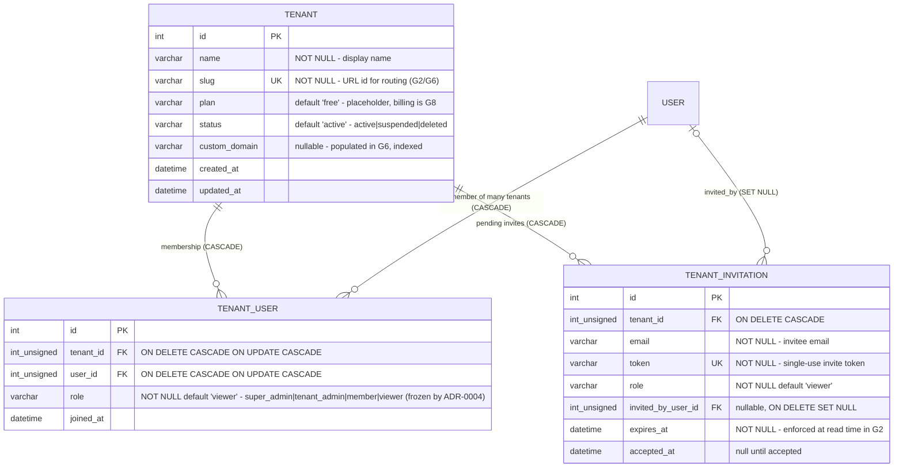

# ERD — TO-BE (Target Multi-Tenant Schema, post-G1)

> Entity-relationship diagram of the schema after Phase G1 implements the [migration contract](./migration-contract.md). Encodes the decisions of [ADR-0002 (isolation model)](../adr/ADR-0002-isolation-model.md) on top of the AS-IS schema in [`erd-as-is.md`](./erd-as-is.md).
>
> **Reading guide:** entities marked `+ tenant_id` below gain the new column in G1. Child/junction and instance-global entities are intentionally **unchanged** — their tenancy is derived through a parent row or is genuinely global.

## New tenant-root entities

Composite uniqueness: `UNIQUE(tenant_id, user_id)` on `tenant_user` (a user appears at most once per tenant); `UNIQUE(token)` on `tenant_invitation`; non-unique index `(tenant_id, email)` for pending-invite lookups.

## Existing business entities — each gains `tenant_id`

Per [ADR-0002](../adr/ADR-0002-isolation-model.md): every business table gains a `tenant_id` FK → `tenant.id` (`ON DELETE CASCADE`, `ON UPDATE CASCADE`), backfilled into the default tenant by G1 task-06. Only the delta vs AS-IS is shown; all other columns carry over unchanged from [`erd-as-is.md`](./erd-as-is.md).

```mermaid
erDiagram
    TENANT {
        int id PK
    }

    MONITOR {
        int id PK
        int_unsigned tenant_id FK "+ NEW, ON DELETE CASCADE, idx(tenant_id,id), idx(tenant_id,user_id)"
        int_unsigned user_id FK "retained as per-user owner link"
        varchar push_token "public ingestion key, now tenant-scoped via monitor"
    }

    GROUP {
        int id PK
        int_unsigned tenant_id FK "+ NEW, ON DELETE CASCADE, idx(tenant_id,id)"
        int_unsigned status_page_id "logical ref retained"
    }

    PROXY {
        int id PK
        int_unsigned tenant_id FK "+ NEW, ON DELETE CASCADE, idx(tenant_id,id)"
        int_unsigned user_id "retained"
    }

    DOCKER_HOST {
        int id PK
        int_unsigned tenant_id FK "+ NEW, ON DELETE CASCADE, idx(tenant_id,id)"
        int_unsigned user_id "retained"
    }

    NOTIFICATION {
        int id PK
        int_unsigned tenant_id FK "+ NEW, ON DELETE CASCADE, idx(tenant_id,id)"
        int_unsigned user_id "retained as per-user owner link"
    }

    STATUS_PAGE {
        int id PK
        int_unsigned tenant_id FK "+ NEW, ON DELETE CASCADE, idx(tenant_id,id)"
        varchar slug "uniqueness becomes (tenant_id, slug) in practice - resolution always pairs (tenant_id, slug)"
    }

    MAINTENANCE {
        int id PK
        int_unsigned tenant_id FK "+ NEW, ON DELETE CASCADE, idx(tenant_id,id)"
        int_unsigned user_id FK "retained"
    }

    API_KEY {
        int id PK
        int_unsigned tenant_id FK "+ NEW, ON DELETE CASCADE, idx(tenant_id,id)"
        int_unsigned user_id FK "retained"
    }

    TAG {
        int id PK
        int_unsigned tenant_id FK "+ NEW, ON DELETE CASCADE, idx(tenant_id,id)"
        varchar name "tags become per-tenant rows"
    }

    REMOTE_BROWSER {
        int id PK
        int_unsigned tenant_id FK "+ NEW, ON DELETE CASCADE, idx(tenant_id,id)"
        int_unsigned user_id "retained"
    }

    TENANT ||--o{ MONITOR : "owns (CASCADE)"
    TENANT ||--o{ GROUP : "owns (CASCADE)"
    TENANT ||--o{ PROXY : "owns (CASCADE)"
    TENANT ||--o{ DOCKER_HOST : "owns (CASCADE)"
    TENANT ||--o{ NOTIFICATION : "owns (CASCADE)"
    TENANT ||--o{ STATUS_PAGE : "owns (CASCADE)"
    TENANT ||--o{ MAINTENANCE : "owns (CASCADE)"
    TENANT ||--o{ API_KEY : "owns (CASCADE)"
    TENANT ||--o{ TAG : "owns (CASCADE)"
    TENANT ||--o{ REMOTE_BROWSER : "owns (CASCADE)"
```

## Entities deliberately unchanged

These keep **no** `tenant_id` column — adding one would double write amplification on hot tables or duplicate information already implied by a parent row ([ADR-0002 Decision](../adr/ADR-0002-isolation-model.md)). Isolation query pattern: `... WHERE monitor_id IN (SELECT id FROM monitor WHERE tenant_id = ?)` (or the equivalent anchor).

```mermaid
erDiagram
    HEARTBEAT {
        int id PK
        int_unsigned monitor_id FK "unchanged - tenancy derived via monitor"
    }
    STAT_MINUTELY {
        int id PK
        int_unsigned monitor_id FK "unchanged"
    }
    STAT_HOURLY {
        int id PK
        int_unsigned monitor_id FK "unchanged"
    }
    STAT_DAILY {
        int id PK
        int_unsigned monitor_id FK "unchanged"
    }
    MONITOR_TAG {
        int id PK
        int_unsigned monitor_id FK "unchanged"
        int_unsigned tag_id FK "both parents tenant-scoped after G1"
    }
    MONITOR_NOTIFICATION {
        int id PK
        int_unsigned monitor_id FK "unchanged"
        int_unsigned notification_id FK "both parents tenant-scoped after G1"
    }
    MONITOR_MAINTENANCE {
        int id PK
        int_unsigned monitor_id FK "unchanged"
        int_unsigned maintenance_id FK "both parents tenant-scoped after G1"
    }
    MAINTENANCE_STATUS_PAGE {
        int id PK
        int_unsigned status_page_id FK "unchanged"
        int_unsigned maintenance_id FK "both parents tenant-scoped after G1"
    }
    MONITOR_GROUP {
        int id PK
        int_unsigned monitor_id FK "unchanged"
        int_unsigned group_id FK "both parents tenant-scoped after G1"
    }
    MONITOR_TLS_INFO {
        int id PK
        int_unsigned monitor_id FK "unchanged"
    }
    INCIDENT {
        int id PK
        int_unsigned status_page_id "unchanged - derived via status_page"
    }
    STATUS_PAGE_CNAME {
        int id PK
        int_unsigned status_page_id FK "unchanged - derived via status_page"
    }
    NOTIFICATION_SENT_HISTORY {
        int id PK
        int_unsigned monitor_id "unchanged - derived via monitor"
    }
    USER {
        int id PK "global identity - membership lives in tenant_user"
    }
    SETTING {
        int id PK "instance-global key/value store, documented exemption"
    }
    DOMAIN_EXPIRY {
        int id PK "cross-tenant domain-expiry cache, see open item C3 in migration-contract"
    }
```

Relationships among these entities are exactly as in [`erd-as-is.md`](./erd-as-is.md) and are not repeated here.

## Index plan summary (G1)

| Table | New composite indexes | Rationale |
| --- | --- | --- |
| `monitor` | `(tenant_id, id)`, `(tenant_id, user_id)` | Tenant list scans + owner-scoped queries inside a tenant |
| `group`, `proxy`, `docker_host`, `notification`, `status_page`, `maintenance`, `api_key`, `tag`, `remote_browser` | `(tenant_id, id)` | Baseline tenant-partitioned access per [ADR-0002](../adr/ADR-0002-isolation-model.md) |
| `tenant` | unique(`slug`), index(`custom_domain`) | Routing lookups in G2/G6 |
| `tenant_user` | unique(`tenant_id, user_id`) | Membership integrity |
| `tenant_invitation` | unique(`token`), index(`tenant_id, email`) | Invite redemption + pending lists |
| child/junction family | *(none)* | Existing `monitor_id`/parent-leading indexes already serve the subquery isolation pattern; no extra write amplification |

Explicitly named indexes follow the repo convention `<table>_<cols>_index` (e.g., `monitor_tenant_id_id_index`) so SQLite and MariaDB agree on names.

## Out of this ERD's scope (noted, not drawn)

- `refresh_token` table (hash, family lineage, expiry) — introduced by [ADR-0004](../adr/ADR-0004-authentication-strategy.md) in **G2**, not G1. It is listed here so readers know the ERD will grow by one entity next phase.
- Any G8 billing columns beyond `tenant.plan` placeholder.
