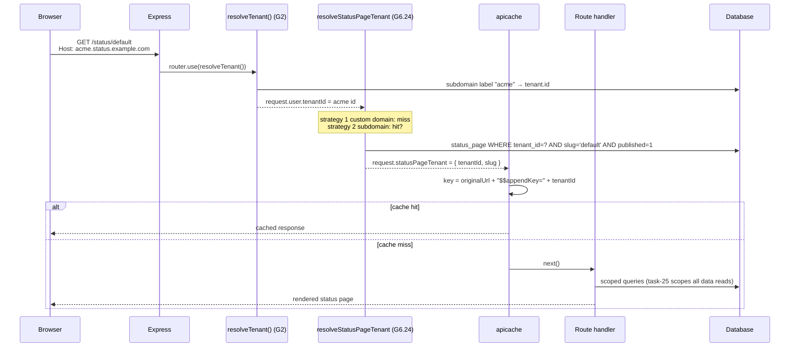
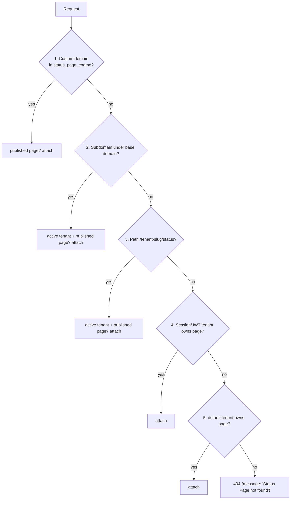

# Status Page Routing & Tenant Resolution (G6.24)

Status: **frozen contract** (task G6.24, kanban `docs/kanban/2026-08-23_multi-tenant-uptime-kuma-plan/task-24.md`). Implements the status-page slice of [ADR-0003](../adr/ADR-0003-routing-and-tenant-resolution.md). Downstream consumers: task-25 (tenant-scoped data layer), task-26 (custom domain wizard + G6 test suite).

## Goal

Every public status-page request resolves to a `(tenantId, slug)` pair **before any data query runs**, so no query ever has to guess which tenant a slug belongs to.

Non-goals (owned elsewhere): tenant-scoped data queries (task-25), tenant branding injection (task-25), CNAME validation wizard / SSL / cache header tuning (task-26), frontend UI (G7).

## Resolution priority (frozen — do not reorder)

Implemented in [`server/middleware/status-page-tenant.js`](../../../server/middleware/status-page-tenant.js) → `resolveStatusPageTenant(request, response, next)`:

| # | Strategy | Source | Match rule |
|---|----------|--------|------------|
| 1 | Custom domain lookup | `Host` / `X-Forwarded-Host` (trustProxy-aware) | Exact hostname in `status_page_cname.domain`; mapped page must exist and be `published = 1` |
| 2 | Subdomain | Hostname under `UPTIME_KUMA_BASE_DOMAIN` | First label = `tenant.slug`, tenant `status = 'active'`, published page for requested slug |
| 3 | Path-based | URL path | First segment `/<tenant-slug>/status...` = `tenant.slug`, active tenant, published page. Dormant on today's routes (no tenant-prefixed route exists yet) but part of the frozen contract for future wiring |
| 4 | Session/JWT | `request.user.tenantId` | Tenant context already resolved by the router-level G2 `resolveTenant()` mount (subdomain → custom_domain → X-Tenant-ID membership-checked → JWT `tid` claim → default). Wins only if that tenant owns a published page for the requested slug |
| 5 | Default tenant | `tenant.slug = 'default'` | Published page for requested slug; keeps single-tenant deployments working unchanged |

On success the middleware attaches:

```js
request.statusPageTenant = { tenantId: <number>, slug: <string> };
```

On failure (all strategies miss) it responds `404 {"message": "Status Page not found"}` itself and never calls `next()` — handlers may trust `request.statusPageTenant` unconditionally.

Notes:

- Custom domain beats subdomain on purpose: a `status_page_cname` row points at one specific page, while a subdomain only identifies a tenant.
- The middleware is intentionally cross-tenant (hostname → tenant *derivation*); each unscoped lookup carries an inline `eslint-disable uptime-kuma/require-tenant-scope` with rationale.

## Where it is registered

- `server/routers/status-page-router.js` — all 9 public routes mount `resolveStatusPageTenant` as the first route-level middleware, **before** apicache:
  `/status/:slug`, `/status/:slug/rss`, `/status`, `/status-page`,
  `/api/status-page/:slug`, `/api/status-page/heartbeat/:slug`,
  `/api/status-page/:slug/manifest.json`, `/api/status-page/:slug/incident-history`,
  `/api/status-page/:slug/badge`.
- Router-level `router.use(resolveTenant())` (G2.10) still runs first and populates `request.user.tenantId`, which strategy 4 consumes.

### Cache namespacing

apicache keys were URL-only; two tenants serving the same path under different hosts would collide in the memory cache. Since G6.24 resolution runs before apicache, `server/modules/apicache/index.js` appends `req.statusPageTenant.tenantId` to every key (`appendKey`). Requests without a resolved tenant keep today's key shape.

## Domain mapping (`loadDomainMappingList`)

`server/model/status_page.js` builds, at boot and whenever refreshed:

```js
StatusPage.domainMappingList = {
    "status.acme.com": { tenantId: 2, slug: "acme-status" },
};
```

Only `published = 1` pages are mapped. Consumers updated for the new shape:

| Consumer | Change |
|----------|--------|
| `server/server.js` entry handler (`GET /`) | Renders the mapped page with `(slug, tenantId)` |
| `server/routers/api-router.js` `/api/entry-page` | Returns `statusPageSlug = mapping.slug` (wire format stays a string for the SPA bootstrap) |
| `StatusPage.getDomainNameList()` | Matches on `slug && tenantId`, so an editor only sees their own tenant's domains |

## Handler signature changes (frozen API)

```js
StatusPage.handleStatusPageResponse(response, indexHTML, slug, tenantId)
StatusPage.handleStatusPageRSSResponse(response, slug, request, tenantId)
```

Both look the page up with `slug = ? AND tenant_id = ?`, double-check `statusPage.tenant_id === tenantId`, and render through `renderHTML(...)`/`buildRSSUrl(...)` which now accept a trailing `tenantId` parameter (reserved for task-25 branding/link injection).

Router data endpoints resolve the page via `tenant_id = ? AND slug = ? AND published = 1` instead of the global `slugToID()`. `slugToID()` itself remains for the socket-handler surface until its own migration.

## Sequence of a public request



Failure path:



## Backward compatibility & behavior changes

- **Single-tenant:** `GET /status/default` resolves via strategy 5 (default tenant backfilled by migration `2026-08-23-0002`) — unchanged behavior when no host/subdomain setup exists.
- **Drafts are no longer publicly routable:** public resolution requires `published = 1` (previously any existing slug rendered). Draft preview belongs to the authenticated surface (task-25/26).
- **Unknown slugs** now return the middleware's JSON 404 instead of an HTML 404 shell.
- **Heartbeat/incident-history endpoints** return `404 Status Page Not Found` for unknown/unpublished slugs instead of empty payloads (matches the incident-history pattern).
- **Badges** still render an N/A badge (not a 404) for unknown/unpublished slugs because they are embedded via `` tags.
- **Cache keys** gain a tenant suffix; no stale cross-tenant hits.

## Downstream contracts

- **task-25 (data layer):** scope every data query by `request.statusPageTenant.tenantId`; inject tenant branding using the trailing parameters this task threaded through `renderHTML()` / `buildRSSUrl()`.
- **task-26 (wizard/tests):** consume `StatusPage.domainMappingList` shape `{ domain: { tenantId, slug } }` for CNAME validation; own `test/backend-test/test-tenant-status-page.js`.
